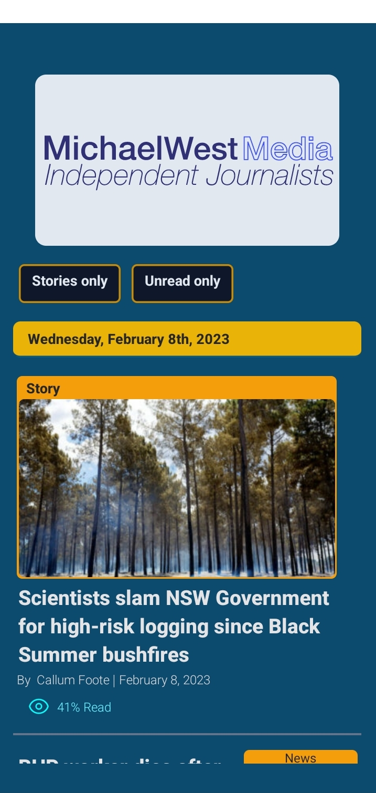
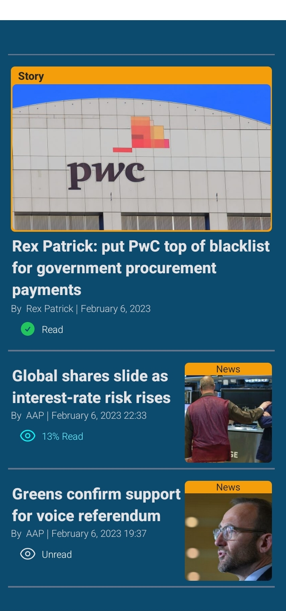
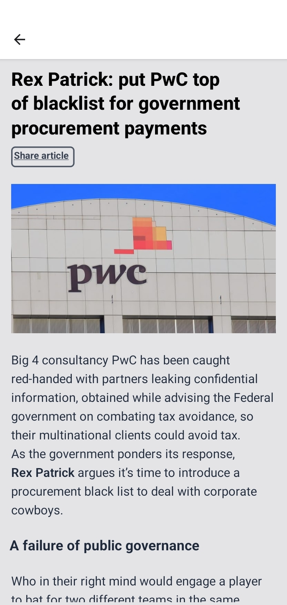
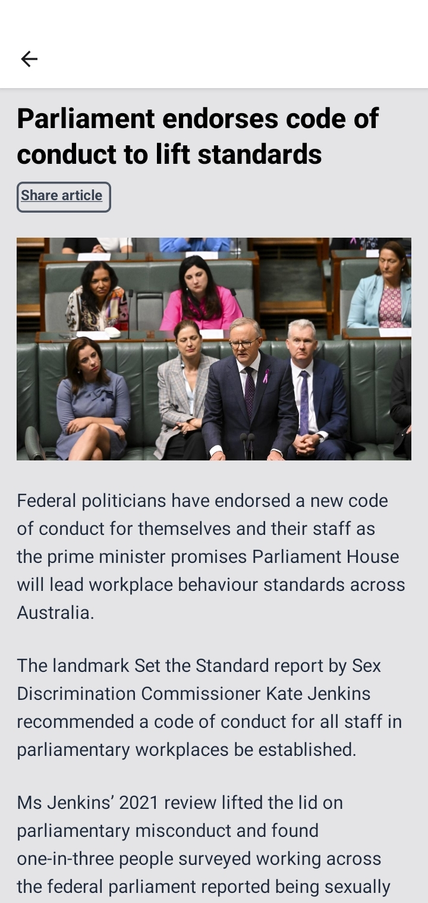

# Michael West Reader

## About

Attempting to learn React Native by building a mobile specific reader for the excellent [Michael West](https://michaelwest.com.au) website.

There are outstanding issues I need to resolve before Google will allow me to publish a news app to the Play Store, so it's not available to
use from there. I've lost motivation to continue building this, as my primary purpose was to learn a bit of React Native.

## Screens

## Getting started

This is a React Native app setup using [Expo](https://docs.expo.dev/)

The easiest way to run the development version of this is by installing the [Expo Go](https://expo.dev/client) app on your phone and setting it up
to run on your WiFi.

Then run:

1. `yarn expo install`
2. `yarn start`
